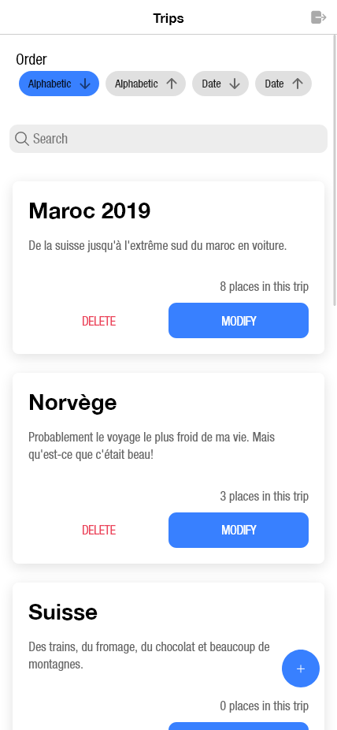
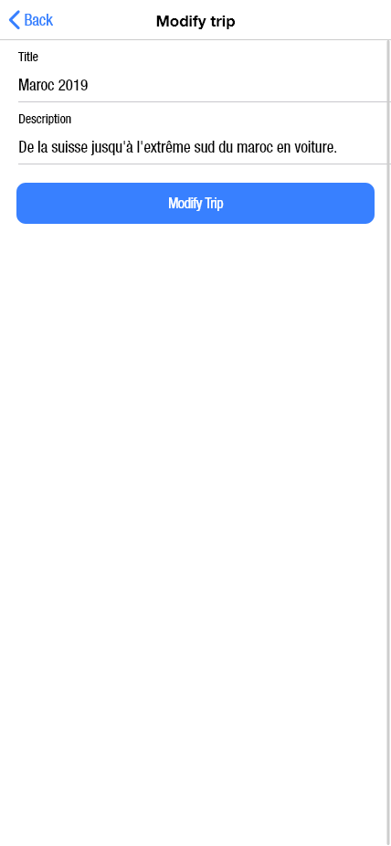
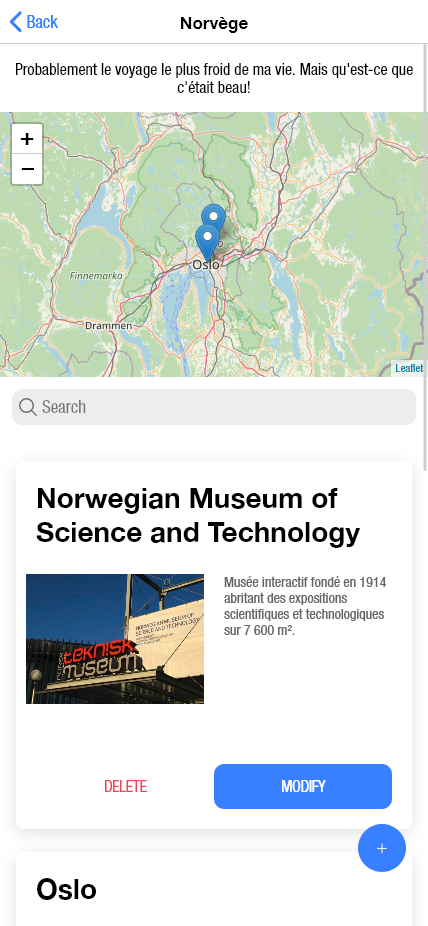
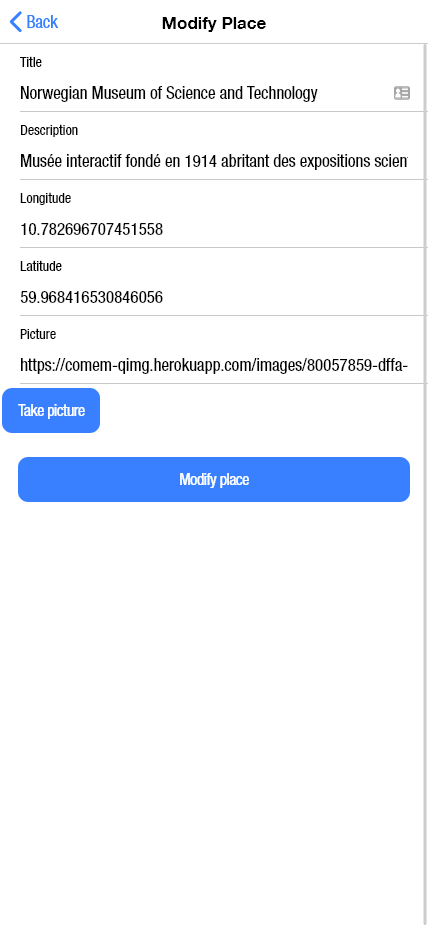
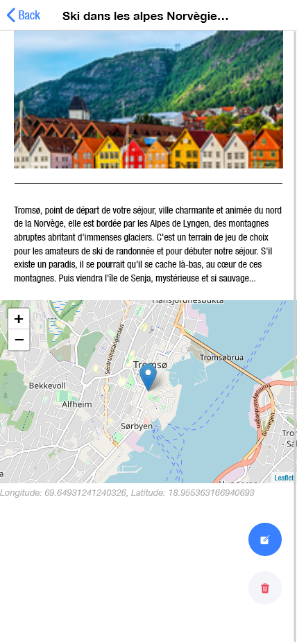

# Journey

Journey est une application permettant aux utilisateurs de mettre en mémoire leurs voyages et les lieux qu’ils ont visité comme un carnet de voyage.
Tout d’abord, lors de sa première visite, l’utilisateur devra se connecter avec ses identifiants ou en créer via le formulaire à cet effet. 

Un fois connecté, l’utilisateur arrive sur la page de ses « Trips ». À l’intérieur de celle-ci il peut : ordonner par ordre alphabétique (ascendant et descendant) et par date (du plus récent au plus ancien et vice-versa) ; il peut rechercher un élément spécifique grâce à la barre de recherche ; il peut consulter ses trips déjà enregistrer ainsi que les supprimer et les modifier ; et finalement il peut ajouter de nouveaux « Trips » grâce au bouton +.

Au clic sur un des « Trips », l’utilisateur entre dans les détails de ce voyage et peut voir les places qui y sont liées avec toutes leurs localisations sur une carte. Sur cette page, il peut aussi ajouter une nouvelle « Place » ainsi que supprimer ou modifier un lieu existant.

En cliquant sur la « Place », l’utilisateur peut observer plus en détail le lieu avec la description complète qu’il a écrit mais aussi l’image associée et la localisation qu’il peut consulter à travers une mini-map. De plus, il peut facilement modifier ce lieu ou le supprimer via les icones en bas à droite de l’écran.

